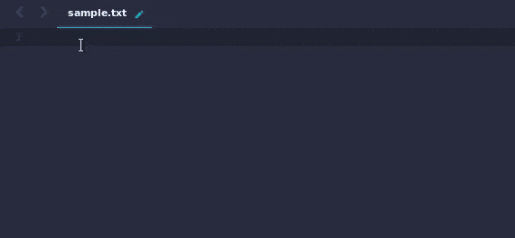

# Pharko
A Sublime Text 3 plugin for organising shared snippets by you and other community members.

With the advent of React components with JSX syntax and Vue single-file-components, a single file can contain a section with javascript, css, and html in which multiple snippets scopes feature might fall short. The idea here is to organize them in a folder structure that suits your needs.

A typical example of folder organization is by having the file type/extension as the root folder, then sub-folder to your heart's content which will contain the actual snippet files. By following this simple folder structure, we open ourselves with a lot of possibilities which will help us expand our toolbelt just like any other Sublime power user.

* Existing javascript, css and html snippets will work with React or Vue compoments.
* There is no need to update the snippets file, just to add more scopes.
* The community can create a snippets reposity at Github (and others) to share their source codes to other users.
* Public repositories can be manually installed inside this package folder, and will be read by this package.
* You don't have to memorize each snippet's trigger keys, because directory traversal seems ways easier when you use the extension names or properly describe directory names.

## Quickpanel Shortcut
Add the following keyboard shortcut to your Key Bindings file

 `{ "keys": ["alt+shift+0"], "command": "pharko_list", "args": {} },`



## Whats New

Additional shortcut to subdirectory inside parent folder
 `{ "keys": ["alt+shift+9"], "command": "pharko_list", "args": { "location" : "php" } },`

Snippets with additional documentation in mind. By including extra xml data on the snippet file,
we are able to create an instruction or sample usage to our users.
Here is an example snippet modification:

```xml
<snippet>
    <content><![CDATA[
public function __construct(${1})
{
    ${2://}
}
]]></content>
    <title>Snippet Title</title>
    <docs><![CDATA[
Your additional information.
]]></docs>
    <code><![CDATA[
<?php
//Sample source code or output
?>
]]></code>
</snippet>
```


## Todos
More improvements will come with this package since the author is just a starting to learn how to code in Python with Sublime package writing in mind.

* Create and read configuration settings
* Automatically install public snippets repository

## License
Released under the MIT license.

Copyright (c) 2017 Marco Hermo <marcz@lab1521.com>

Permission is hereby granted, free of charge, to any person obtaining a copy
of this software and associated documentation files (the "Software"), to deal
in the Software without restriction, including without limitation the rights
to use, copy, modify, merge, publish, distribute, sublicense, and/or sell
copies of the Software, and to permit persons to whom the Software is
furnished to do so, subject to the following conditions:

The above copyright notice and this permission notice shall be included in all
copies or substantial portions of the Software.

THE SOFTWARE IS PROVIDED "AS IS", WITHOUT WARRANTY OF ANY KIND, EXPRESS OR
IMPLIED, INCLUDING BUT NOT LIMITED TO THE WARRANTIES OF MERCHANTABILITY,
FITNESS FOR A PARTICULAR PURPOSE AND NONINFRINGEMENT. IN NO EVENT SHALL THE
AUTHORS OR COPYRIGHT HOLDERS BE LIABLE FOR ANY CLAIM, DAMAGES OR OTHER
LIABILITY, WHETHER IN AN ACTION OF CONTRACT, TORT OR OTHERWISE, ARISING FROM,
OUT OF OR IN CONNECTION WITH THE SOFTWARE OR THE USE OR OTHER DEALINGS IN THE
SOFTWARE.
